# El editor de programación 

## Introducción

La plataforma de programación es una modificación de [*Scratch*](https://scratch.mit.edu/) a la que hemos añadido algunos bloques nuevos para incorporar Inteligencia Artificial con Machine Learning[^1]. Para distinguirla del proyecto original hemos llamado a esta modificación *LearningML Scratch*.

[^1]: El proyecto *Scratch* fue desarrollado por el Lifelong Kindergarten Group del MIT Media Lab, bajo la dirección del profesor Mitchel Resnick y su código se distribuye con una licencia abierta. Gracias a esto hemos podido construir la versión modificada *LearningML Scratch*.

El acceso a la plataforma de programación se hace puede hacer:

- Desde el editor de modelos haciendo clic en el botón del gatito que se encuentra en el menú superior.
- Directamente desde la URL [`https://learningml.org/scratch`](https://learningml.org/scratch).

La principal novedad de la nueva versión de *LearningML Scratch* es que se puede usar en combinación con el editor de modelos o sin él. Es decir, también se puede usar de manera autónoma. En cualquier caso, esta versión de *Scratch* mantiene todas las funcionalidades del *Scratch* original salvo la mochila y las cuentas de usuario. 

Esto último implica que no podrás copiar trozos de código al espacio de la mochila ni tampoco podrás usar directamente los proyectos que tengas en tu cuenta de *Scratch*. Sin embargo, si quieres usar un proyecto de *Scratch* en *LearningML Scratch*, basta con que lo descargues a tu computadora con el menú "Archivo->Guardar en tu ordenador" de *Scratch* y lo cargues en *LearningML Scratch* con el menú "Archivo->Cargar en tu ordenador".

Es muy importante que tengas en cuenta que son aplicaciones diferentes que están alojadas en distintos servidores web. Por ello, tienen URLs distintas:

|URL Scratch MIT        |URL LearningML Scratch        |
|-----------------------|------------------------------|
|https://scratch.mit.edu|https://learningml.org/scratch|

No obstante, cualquier proyecto que hayas realizado con *Scratch* puedes usarlo en *LearningML Scratch*. Sin embargo, los proyectos que desarrolles con *LearningML Scratch*, si usan bloques de Machine Learning, **no pueden ser cargados en Scratch**, pero si no usan tales bloques, sí. 

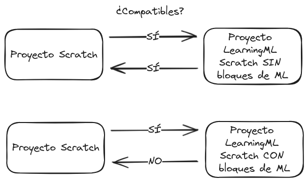

## Creación de modelos de ML en LML-Scratch

Cualquier programa que puedas construir con *Scratch* también puedes hacerlo con *LearningML Scratch*. Lo que aporta esta última plataforma es la posibilidad de crear y utilizar modelos de Machine Learning gracias a los bloques especiales que incluye para estas tareas.

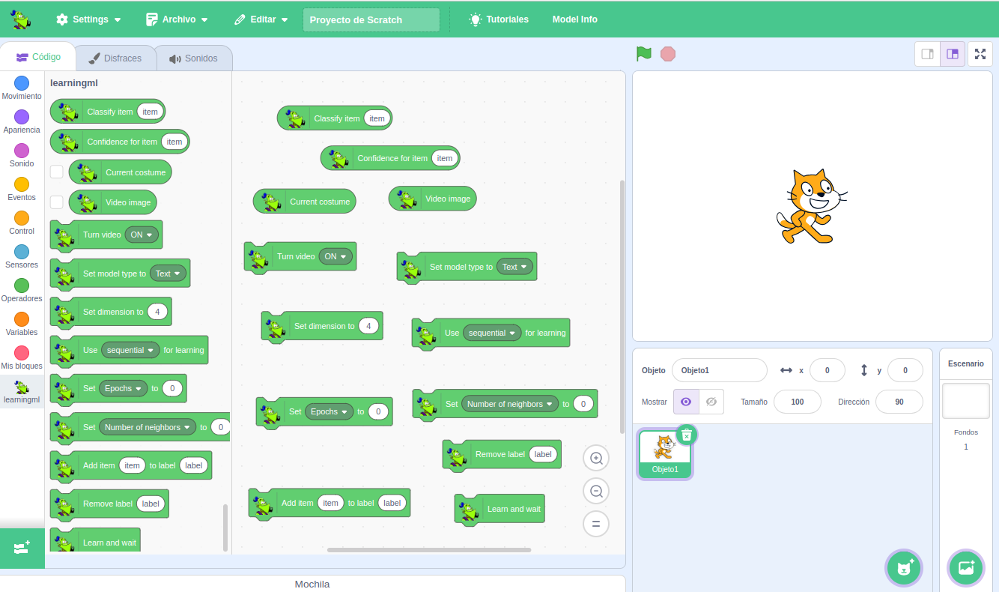

El uso de estos modelo puede ser organizado en 4 casos de uso que son combinables:

1. Uso directo de un modelo de Machine Learning creado con el editor de modelos.
2. Carga de un modelo de Machine Learning creado y guardado en un fichero `.mdl` con el editor de modelos.
3. Uso del modelo de Machine Learning que viene al cargar un proyecto de *LearningML Scratch* desde un archivo `.sb3`.
4. Creación directa de un modelo de Machine Learning con los bloques de programación de *LearningML Scratch".

El primer caso de uso requiere usar *LearningML Scratch* **simultáneamente** con el editor de modelos. En los 3 últimos se puede usar *LearningML Scratch* de manera autónoma, es decir, sin necesidad de abrir el editor de modelos. Aunque no pasa nada si lo tienes abierto. Estas 3 últimas formas de usar *LearningML Scratch* es una novedad que incorpora *LearningML2*

### Caso de uso 1. El modelo vienen directamente del editor de modelos

Esta es la manera más directa de usar los bloques de Machine Learning de *LearningML Scratch*. Así se hacía en las versiones anteriores. El flujo de uso es el siguiente:

- Se abre el editor de modelos y se construye un modelo de Machine Learning.
- Una vez que lo hemos evaluado y estamos satisfechos abrimos *LearningML Scratch* haciendo clic en el botón con el icono del gatito de Scratch. 
- El modelo está disponible en *LearningML Scratch* y puedes usarlo mediante los bloques de Machine Learning. 
- Si generas un nuevo modelo en el editor de modelos, este se actualizará en *LearningML Scratch*. Si no has cerrado la pestaña de *LearningML Scratch* no es necesario que vuelvas a abrirla con el botón del icono del gatito del editor de modelos. El modelo se actualizará automáticamente.
- Para saber qué modelo está disponible en *LearningML Scratch* puede hacer clic en el menú "Model Info". Aparecerá una ventana modal con la siguiente información: 
    - Nombre del modelo.
    - Tipo de datos que reconoce: textos, imágenes o conjuntos numéricos.
    - Algoritmo con el que se ha generado: red neuronal o KNN.
    - Clases que reconoce.
    - Valores de los hiperparámetros que se han usado en el proceso de aprendizaje.

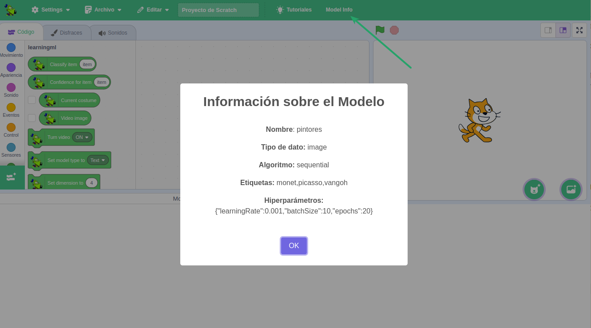

En este caso de uso los bloques que más usarás son los de clasificación ("Classify item [item]") y confidencia ("Confidence for item [item]"). Con el primero obtienes la clase más probable del dato que le pases como entrada, mientras que con el segundo se obtiene el porcentaje de confianza de dicha clase más probable. 

Estos dos bloques sirven para clasificar items de cualquier tipo de datos (textos, imágenes o números).

Si el modelo es de reconocimiento de texto debes pasarle un texto como argumento.

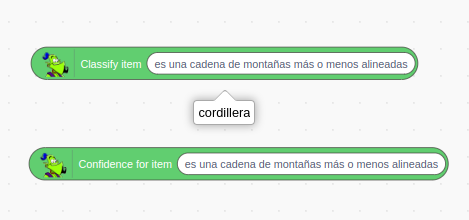

Si el modelo es de reconocimiento de conjuntos numéricos debes pasarle un conjunto de números separados por comas (",") y de la misma dimensión que los datos que se usaron en la generación del modelo.

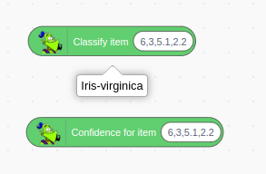

Y si el modelo es de reconocimiento de imágenes tienes dos opciones: pasarle uno de los disfraces del objeto, o activar la cámara y tomar instantáneas.

para clasificar imágenes que son disfraces del objeto, primero debes añadir como disfraces del objeto las imágenes que deseas clasificar:

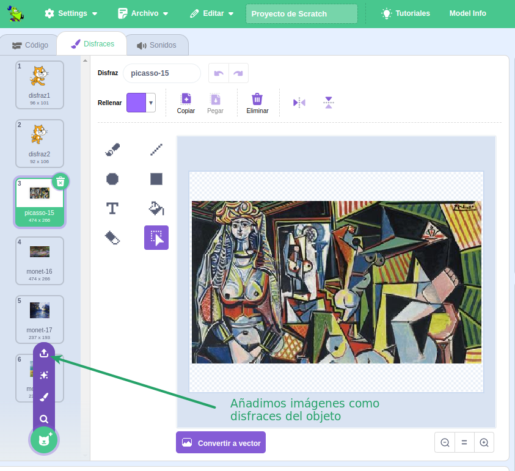

Después eliges el disfraz con el bloque "Cambiar disfraz a [disfraz]" de la sección "Apariencia". Y finalmente usas como argumento del bloque "Classify item [item]" (o "Confidence for item [item]") el bloque "Current costume":

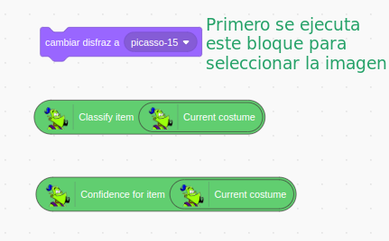

Para clasificar imágenes que provienen de la cámara configurada en el navegador web, primero debes activarla con el bloque "Turn video [ON]". Con este bloque puedes activar la cámara en modo normal, en modo espejo (FLIPPED) y desactivarla. Después debes pasar como argumento de los bloques de clasificación el bloque "Video Image".

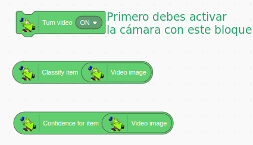

### Caso de uso 2. Carga de un modelo de Machine Learning desde un fichero `.mdl`.

Cuando generas un modelo con el editor de modelos tienes la posibilidad de guardar el modelo entrenado en un fichero con extensión `.mdl`. Esto se hace desde el menú "Archivo -> Guardar modelo en tu ordenador" del editor de modelos. Estos archivos de modelo pueden ser cargado en cualquier momento en *LearningML Scratch*. Solo tienes que usar el menú "Archivo -> Load ML model from your computer". Se abrirá un navegador de ficheros con el que puedes buscar el archivo `.mdl` y cargarlo.

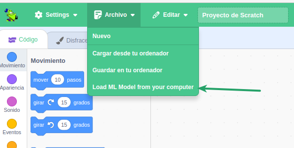

Una vez cargado aparecerá la ventana modal con la información del modelo cargado (la misma que aparece al hacer clic en el menú "Model info"). Una vez cargado puedes realizar clasificaciones o usar otros bloques para añadir nuevos datos de ejemplo y mejorar el modelo. Siempre usando el mismo tipo de datos para el que se entrenó el modelo.

Esta funcionalidad puede resultar muy útil si quieres desarrollar varios programas distintos con el mismo modelo. O si quieres pasarle a un compañero un modelo que has elaborado para que lo use en una aplicación *LearningML Scratch*.

>Nota. Es importante entender que los archivos `.mdl` NO contienen los datos con los que se ha construido el modelo, si no que se trata de un modelo que ha sido previamente entrenado y guardado preentrenado

### Caso de uso 3. Carga del modelo que viene en un fichero `.sb3`

En cualquier momento puedes guardar tu proyecto de *LearningML Scratch* con el menú "Archivo -> Guardar en tu ordenador". Los proyectos así guardados generan un archivo con la extensión `.sb3`. Si el proyecto que has guardado tenía algún modelo cargado por cualquiera de los mecanismos explicados en estos casos de uso, cuando vuelvas a cargarlo con el menú "Archivo -> Cargar desde tu ordenador" tendrás disponible dicho modelo además del código. Es decir, los archivos `.sb3` de *LearningML Scratch* contienen información sobre el modelo de Machine Learning.

### Caso de uso 4. Uso autónomo

Este caso de uso representa una importante novedad en *LearningML2*. Se han incluido nuevos bloques de programación que hacen posible la creación de modelos de Machine Learning desde el propio editor de programación. Esto significa que se puede prescindir completamente del editor de modelos. En este caso es el propio usuario quien construye el modelo realizando las fases del Machine Learning supervisado en el propio programa de *LearningML Scratch*. 

En general el flujo de construcción del modelo será el siguiente:

- Elige el tipo de datos que reconocerá el modelo (texto, imagen, números) con el bloque `Set model type to [modeltype]`.
- Añade datos de ejemplo del tipo seleccionado en el punto anterior con el bloque `Add item [item] to class [class]`.
- Elige el algoritmo con el bloque `Use [algorithm] for learning`.
- Define los hiperparámetros del algoritmo con `Set [hyperparam] to [value]`.
- Construye el modelo con el bloque `Learn and wait`.

>Nota: Recuerda que puedes usar el menú "Model info" para obtener la información del modelo disponible en *LearningML Scratch"

Llegados a este punto, se pueden usar los bloques de clasificación como se explicó en el caso de uso 1, y los demás bloques para desarrollar una aplicación que use el modelo generado. 

Si guardas el proyecto en un archivo `.sb3`, el modelo quedará almacenado en dicho archivo, de manera que al volverlo a cargar el modelo estará disponible.

## Descripción de los bloques para Machine Learning

### Bloque *classify item*

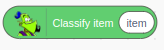

Es un reporter que devuelve la clase más probable a la que pertenece el elemento que se le pasa como argumento según el modelo cargado en *LearningML Scratch*. El tipo de dato del elemento debe coincidir con el que el modelo es capaz de tratar: texto, imagen o conjunto de números.

### Bloque *confidence for item*

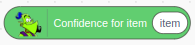

Es un reporter que devuelve la probabilidad, expresada como porcentaje, de la clase más probable a la que pertenece el elemento que se le pasa como argumento según el modelo cargado en *LearningML Scratch*.El tipo de dato del elemento debe coincidir con el que el modelo es capaz de tratar: texto, imagen o conjunto de números.

### Bloque *current costume*

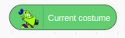

Es un reporter que devuelve el índice del disfraz actual, es decir, del disfraz que muestra el objeto en el momento en que se ejecuta el bloque.

### Bloque *video image*

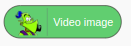

Es un reporter que devuelve una instantánea de la cámara configurada en el navegador web en el momento en que se ejecuta el bloque.

### Bloque *turn video*

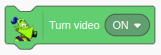

Es un comando que activa la cámara configurada en el navegador web (ON), la activa en modo espejo (ON FLIPPED), o la desactiva (OFF).

### Bloque *set model type*

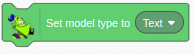

Es un comando que define el tipo de modelo que se va a generar. Los valores posibles son `Text`, `Image` o `Numerical`.

### Bloque *set dimension*

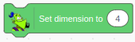

Es un comando cuyo argumento debe ser un número que indica la dimensión de los vectores (conjunto de números) que se van a añadir como ejemplos cuando se desea generar un modelo de reconocimiento de conjuntos numéricos.

### Bloque *use algorithm for learning*

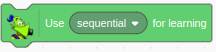

Es un comando con el que se define el algoritmo que se usará para generar el modelo. El argumento es un desplegable que puede ser `sequential` (red neuronal) o `knn` (KNN).

### Bloque *set hyperparameter* (red neuronal)

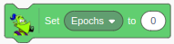

Es un comando con el que se definen los hiperperámetros del algoritmo red neuronal.

### Bloque *set hyperparameter* (knn)

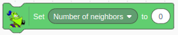

Es un comando con el que se definen los hiperparámetros del algoritmo KNN.

### Bloque *add item to label*

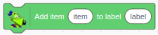

Es un comando con el que se añaden ejemplos (items) a etiquetas (o clases). El primer argumento es el ejemplo y el segundo la etiqueta. Es importante que el ejemplo sea del mismo tipo de dato que el que se haya elegido con el bloque *set model type*

### Bloque *remove label*

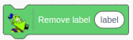

Es un comando con el que se borra la etiqueta cuyo nombre coincide con el argumento.

### Bloque *learn and wait*

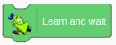

Es un comando con el que se ejecuta el algoritmo de Machine Learning para generar el modelo. Hasta que no se genera el modelo no se ejecuta el siguiente bloque. Esta ejecución puede durar varios segundos o incluso algunos minutos si el número de datos es muy grande.