# El *editor de modelos* de Machine Learning

## Introducción

Con esta aplicación el usuario puede construir sus propios modelos de Machine Learning. Utiliza una estrategia conocida como *Machine Learning Supervisado* que implica recolectar conjuntos de ejemplos de distintas clases y etiquetarlos manualmente con la clase que les corresponda.

Todas las técnicas de Machine Learning, sea cual sea su tipo, tienen como objetivo construir un *modelo* capaz de realizar algún tipo de tarea para la que se requiere algún tipo de "inteligencia" como clasificar, reconocer o generar objetos (textos, imágenes, video, música, etcétera). La característica más importante de cualquiera de estas técnicas es su **naturaleza inductiva**, pues construyen el *modelo* como resultado de un análisis estadístico de multitud de datos de ejemplo. El análisis y la consecuente construcción del *modelo* lo realiza alguno de los muchos *algoritmos* de Machine Learnig existente. En resumen, se puede concluir que cualquier técnica de Machine Learning consiste en:

> la construcción de un modelo de inteligencia artificial a partir del análisis estadístico de un conjunto de datos de ejemplo.

Una vez obtenido el *modelo* se puede utilizar en una aplicación informática para resolver problemas relacionados con el tipo de tarea para la que ha sido diseñado.

Las técnicas de Machine Learning pueden agruparse en tres tipos:

- Aprendizaje supervisado.
- Aprendizaje no supervisado.
- Aprendizaje por refuerzo.

Actualmente existen otros tipos de Machine Learning. La IA Generativa es, sin lugar a duda el tipo más conocido por su explosiva aparición en los últimos años. Pero, en esencia, la clasificación anterior engloba a todos, pues o son modificaciones o utilizan una mezcla de alguno de ellos.

*LearningML+* únicamente incorpora (por lo pronto[^1]), el Aprendizaje Supervisado, el cual, como reconoce [Andrew Ng](https://youtu.be/5p248yoa3oE?t=104) es el más relevante por la cantidad de aplicaciones de IA que lo usan.

[^1]: La intención del equipo de LearningML es continuar el desarrollo para incorporar nuevos tipos de Machine Learning.

El aprendizaje supervisado se produce en tres fases:

1. Entrenamiento. El usuario recopila un conjunto de datos de ejemplo del tipo que se desea reconocer o clasificar y los etiqueta con la clase a la que pertenece. Se trata de un proceso manual; es el humano quien realiza y organiza estos datos.

2. Aprendizaje. Los datos de ejemplo debidamente organizados, que es lo mismo que decir etiquetados, se introducen como entrada de un algoritmo de Machine Learning que, previamente, ha debido se elegido por el usuario entre los muchos existentes. Durante esta fase el algoritmo realiza el análisis de los datos para encontrar patrones y generar el *modelo* de Machine Learning.

3. Evaluación. El usuario prueba el modelo construido sobre un conjunto de datos similares pero distintos a los usados en la fase de entrenamiento. El objetivo es comprobar su capacidad de *generalización*. Es decir, cómo de bueno es para reconocer o clasificar ejemplos que no se utilizaron durante el aprendizaje.

*LearningML+* guía al usuario a través de estas 3 fases para construir *modelos* de Machine Learning capaces de reconocer texos, imágenes o conjuntos numéricos.

## Pantalla de selección de tarea

La primera pantalla que presenta *LearningML+* presenta 3 tarjetas que sirven para seleccionar el tipo de datos que quieres reconocer en tu modelo de Machine Learning: textos, imágenes o conjuntos numéricos. Basta con hacer clic en cualquiera de ellas para iniciar el proceso de construcción del modelo.

También presenta un menú superior que es común a toda la aplicación. Más adelante se describirán sus funcionalidades.

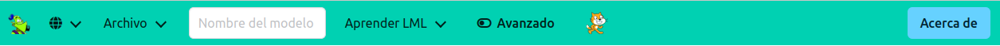

## Construcción de modelos de reconocimiento de textos

Para construir un modelo de reconocimiento de textos debes hacer clic en la tarjeta "Reconocimiento de texto" de la pantalla principal. Se abrirá la pantalla de construcción de modelos con los elementos necesarios para introducir textos de ejemplo etiquetados.

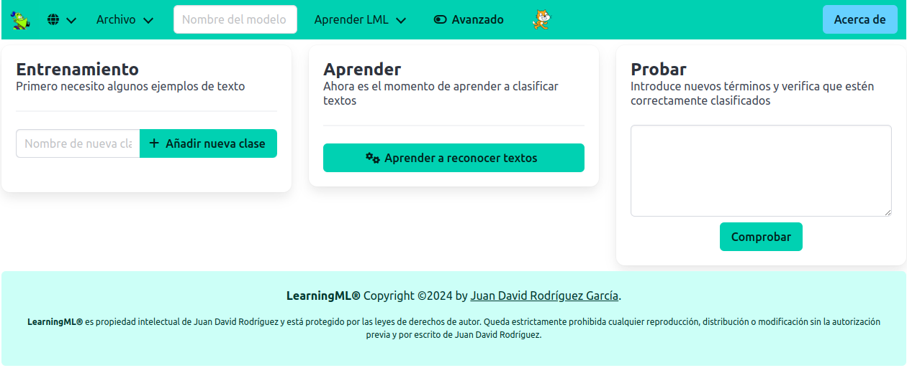

Esta pantalla está dividida en 3 partes que se corresponden con las 3 fases del aprendizaje supervisado: entrenamiento, aprendizaje y evaluación.

### Entrenamiento

Para introducir los textos de ejemplo, primero debes crear las clases, también llamadas etiquetas. Cada clase se crea introduciendo su nombre en el cuadro de texto de la zona de "Entrenamiento" y haciendo clic en el botón "Añadir nueva clase". Se creará un contenedor en el que debes añadir los textos que pertenezcan a esa clase, esto es, que tengan esa etiqueta.

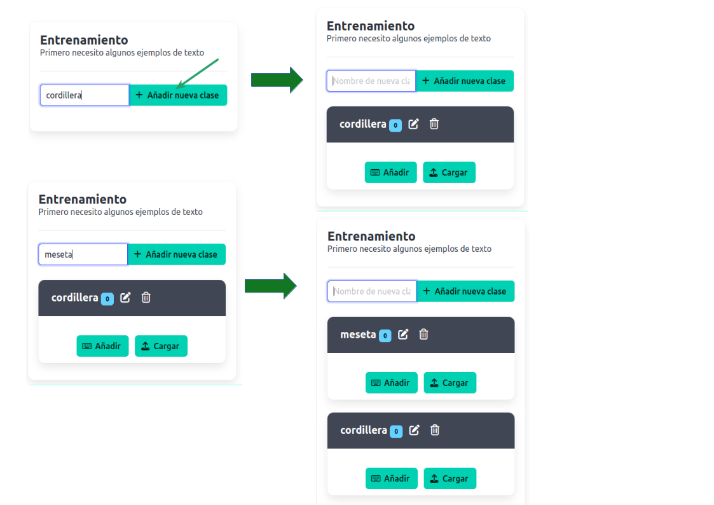

Cada contenedor ofrece en la parte superir botones para editar el nombre de la clase y para eliminarla. Y en la parte inferior un botón para añadir textos desde el editor y otro para añadirlos desde un archivo de textos.

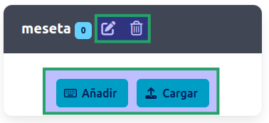

Al hacer clic en el botón "Añadir" se abre un editor de textos en el que puedes añadir tantos textos como quieras a la clase en cuestión. 

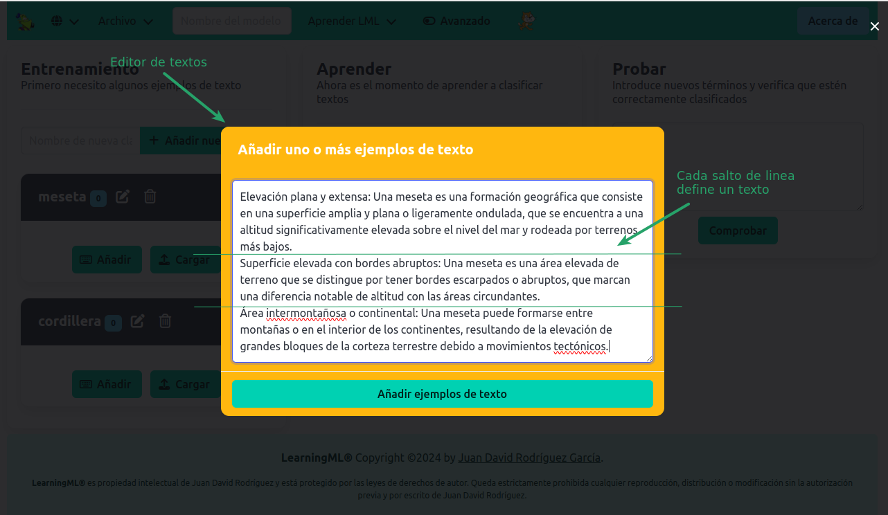

Cada nueva linea que añadas al editor será interpretada como un texto cuando hagas clic en el botón "Añadir ejemplos de texto".

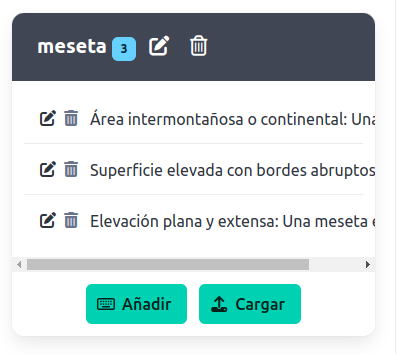

Si ya dispones de un archivo de texto con los textos que quieres añadir a la clase puedes usar el botón "Cargar" del contenedor de clase. Se abrirá un navegador de ficheros con el que puedes localizar el archivo y cargarlo.

También puedes editar los textos que has añadido usando el botón con el icono de un lápiz que aparece al lado de cada texto o borrarlo usando el botón con el icono de cubo de basura.

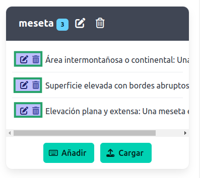

De cualquiera de estas dos formas: usando el editor de textos o el navegador de ficheros, irás completando tu conjunto de ejemplos de entrenamiento.

### Aprendizaje

En esta fase un algoritmo de Machine Learning analizará los datos de ejemplo que has introducido en la fase de entrenamiento y construirá un modelo capaz de reconocer o clasificar textos distintos, pero similares, a los del conjunto de datos. Es lo que se denomina el poder de generalización del modelo. Ten en cuenta que este algoritmo necesita al menos dos clases y varios ejemplos en cada clase (cuantos más mejor).

En el modo básico de LearningML+ (más adelante se explicará el modo avanzado), para ejecutar el algoritmo, tan solo hay que hacer clic en el botón "Aprender a reconocer textos" de la zona "Aprender".

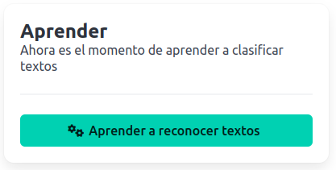

Entonces aparecerá una ventana modal que indica el progreso del proceso de construcción del modelo. El tiempo que necesita el algoritmo de Machine Learning será mayor cuanto más textos de ejemplos hayas añadido al conjunto de datos de entrenamiento. Mientras el algoritmo está ejecutándose, aparece una ventana modal con una barra de progreso y una píldora de conocimiento sobre fundamentos del Machine Learning. 

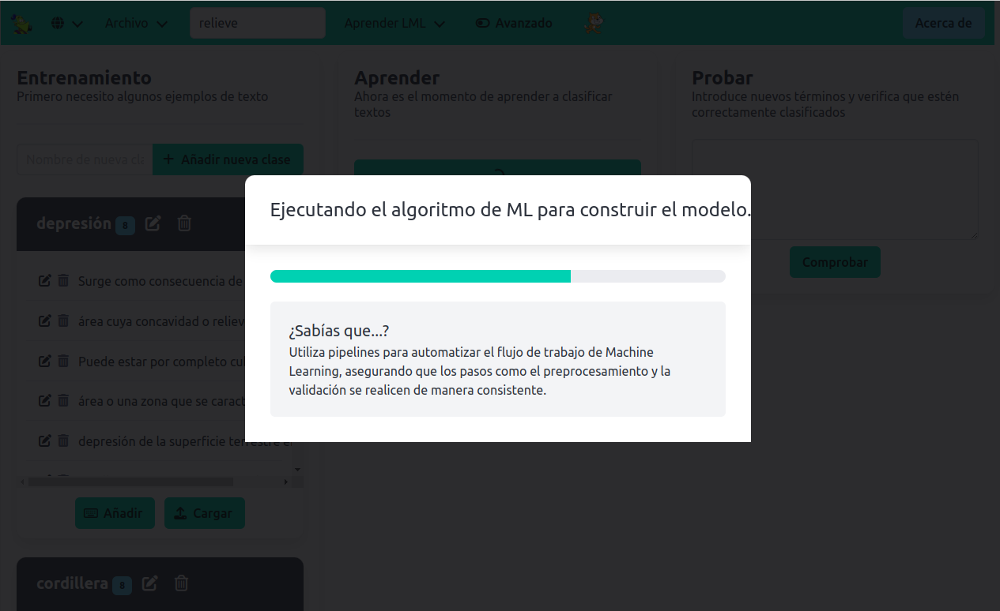

Al finalizar, en la misma ventana modal, se informa del tiempo que se ha invertido en construir el modelo.

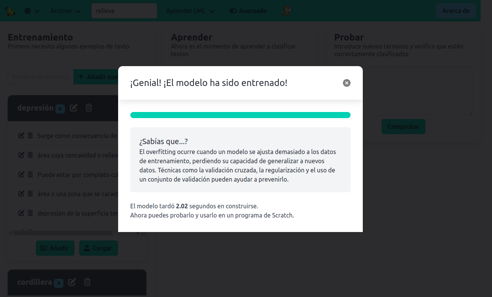

### Evaluación

La última fase del Machine Learning supervisado consiste en evaluar la calidad del modelo construido alimentándolo con textos diferentes pero similares a los usados en el conjunto de datos de entrenamiento. Basta con introducir un texto en el área de textos de la zona "Probar" y hacer clic en el botón "Comprobar". 

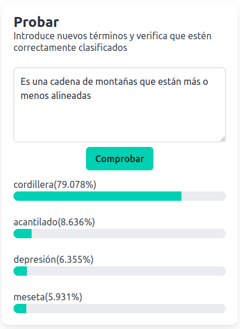

El resultado muestra la **confianza** para cada una de las clases, esto es, la probabilidad en términos de porcentaje, de que el texto introducido pertenezca a cada una de las clases según los cálculos realizados por el modelo construido.

Es importante realizar varias pruebas, cuantas más mejor. Ten en cuenta que el modelo construido NO es infalible y puede fallar en algunos casos. Si no estamos satisfechos con los resultados que arroja el modelo con los textos de prueba, puedes añadir más textos de ejemplo a las clases de la zona "Entrenar". Incluso puedes añadir nuevas clases con más textos. Una vez que lo hayas hecho, como el conjunto de datos ha cambiado, debes volver a construir el modelo, es decir, volver a hacer clic en el botón "Aprender a reconocer textos" de la zona "Aprender". Seguramente la calidad del modelo haya mejorado. Puedes comprobarlo realizando, una vez más, una fase de pruebas. Este proceso es iterativo y puedes repetirlo todas las veces que quieras hasta obtener un modelo que te satisfaga.

Llegados a este punto puedes desarrollar una aplicación informática con Scratch que use el modelo de Machine Learning que acabas de construir. Pero esto se explicará más adelante en la sección dedicada al **Editor de programación** de este mismo manual.

## Construcción de modelos de reconocimiento de imágenes

Para construir un modelo de reconocimiento de imágenes debes hacer clic en la tarjeta "Reconocimiento de imágenes" de la pantalla principal. Se abrirá la pantalla de construcción de modelos con los elementos necesarios para introducir imágenes de ejemplo etiquetadas.

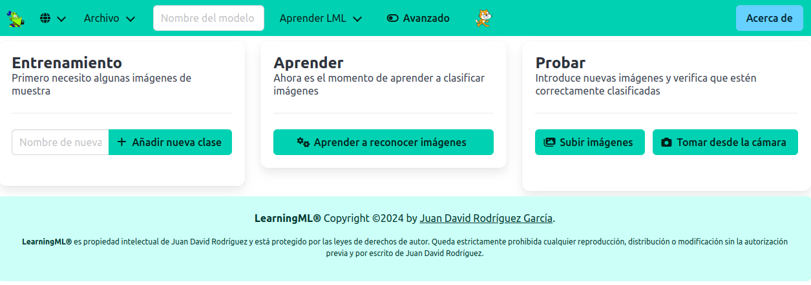

El procedimiento para crear modelos de reconocimiento de imágenes es idéntico al de reconocimiento de textos que acabamos de ver. La única diferencia es que en la fase de entrenamiento y de evaluación usaremos imágenes en lugar de textos. 

### Añadir imágenes en la fase de entrenamiento

En cada uno de los contenedores de clases aparecen dos botones para añadir imágenes.

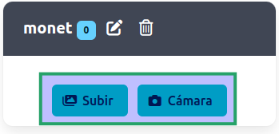

Con el botón "Subir" puedes añadir imágenes (`.jpg`, `.png`, `.webp`, `.svg`) a través del navegador de ficheros. Ten en cuenta que puedes usar en combinación con el puntero del ratón las teclas "Mayúsculas" y/o "Ctrl" para elegir varias imágenes de una sola vez.

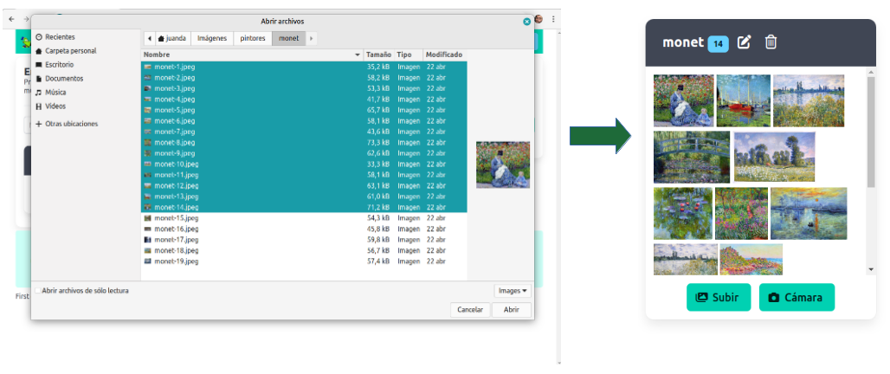

Con el botón "Cámara" se activará la cámara que tengas configurada en tu navegador y podrás añadir instantáneas tomadas con ella. Cuando se activa la cámara aparece la imagen que esté tomando en ese momento y los botones "Captura" y "Cerrar". Cada vez que hagas clic en el primero se añádirá una instantánea a la clase en cuestión.

### Añadir imágenes en la fase de evaluación

Al igual que en la fase de entrenamiento, en la fase de evaluación aparecen dos botones, uno para añadir imágenes desde un navegador de ficheros "Subir imágenes" y otro para hacerlo desde la cámara configurada en el navegador "Tomar desde cámara". Funcionan de la misma manera que se ha explicado en el punto anterior.

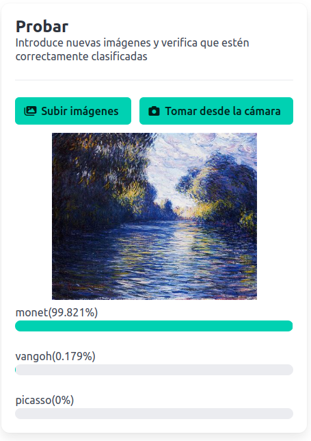

## Construcción de modelos de reconocimiento de conjuntos numéricos

Para construir un modelo de reconocimiento de conjuntos numéricos debes hacer clic en la tarjeta "Reconocimiento de números" de la pantalla principal. Se abrirá la pantalla de construcción de modelos con los elementos necesarios para introducir conjuntos numéricos de ejemplo etiquetados.

### Qué son los conjuntos numéricos

Los conjuntos numéricos son datos tabulados al estilo de una hoja de cálculo. En realidad, todos los datos que son introducidos en un algoritmo de Machine Learning deben ser de este tipo. En el caso de los textos y las imágenes, un procedimiento denominado *feature extraction* (extracción de características) convierte los textos o las imágenes en conjuntos de números, y son estos últimos los que se introducen en el algoritmo de Machine Learning para construir el modelo. Se puede decir por tanto que los conjuntos numéricos son el tipo de datos natural con que trabajan las técnicas de Machine Learning.

Lo mejor para comprender este tipo de datos es usar un ejemplo. Supongamos que pretendemos construir un modelo para reconocer flores que pertenecen a tres especies distintas denominadas: *iris virginica*, *iris versicolor* e *iris setosa*. Para ello, se han realizado medidas sobre la longitud del sépalo, la anchura del sépalo, la longitud del pétalo y la anchura del pétalo de 150 ejemplares distintos. Es decir, cada conjunto numérico que representa a un ejemplar consta de 4 números. Estos serían los 3 primeros ejemplares de la clase *iris-setosa*

| longitud del sépalo | anchura del sépalo | longitud del pétalo | anchura del pétalo|
|---------------------|--------------------|---------------------|-------------------|
| 5.1                 | 3.5                | 1.4                 | 0.2               |
| 4.9                 | 3.0                | 1.4                 | 0.2               |
| 4.7                 | 3.2                | 1.3                 | 0.2               |

Cada fila de la tabla anterior representa a un ejemplar. Y cada columna representa una característica. En este caso se han elegido 4 características de los objetos, esto es, de las flores iris, que dan lugar a un conjunto de 4 números para cada ejemplar. Técnicamente a cada uno de estos conjuntos de 4 números se le llama **vector**. Los vectores se caracterizan por su **dimensión**, que no es más que el número de elementos que componen el vector. En este caso la dimensión es **4**. Es muy importante que **todos** los vectores que se introducen como entrada del algoritmo de Machime Learning tengan la **misma** dimensión.

### Cómo introducir vectores como datos de entrenamiento

Al igual que ocurre con el reconocimiento de textos y de imágenes, lo primero que debes hacer para construir un modelo de reconocimiento de números es añadir las clases (etiquetas) del problema. En el ejemplo de las flores iris añadirás 3 clases: *iris virginica*, *iris versicolor* e *iris setosa*. Cada contenedor de clase muestra 2 botones: "Añadir" y "Cargar".

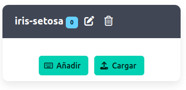

El botón "Añadir" lleva a un editor de texto idéntico al del reconocimiento de textos. Lo usaremos para introducir los vectores como filas de números separados por comas. Los tres primeros ejemplares de la clase *iris-setosa* ilustrados en el apartado anterior se introducirían así.

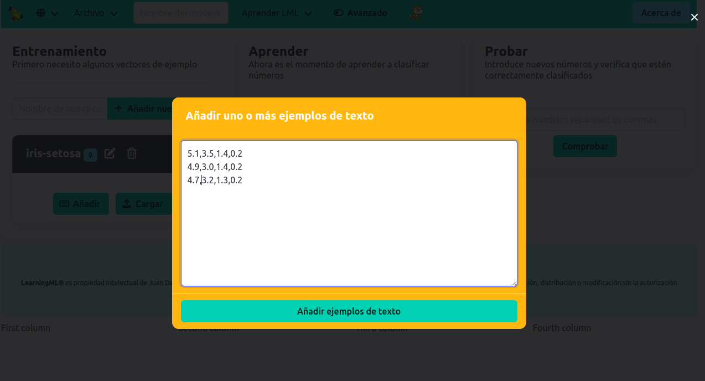

El caracter coma (,) separa cada elemento del vector y el caracter punto (.) se usa como separador decimal. Una vez pulsado el botón "Añadir ejemplos" se añadirán al contenedor de la clase.

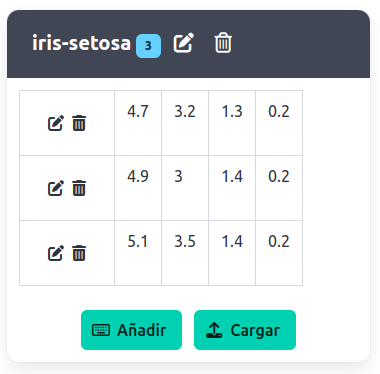

Donde puedes editarlos uno a uno con el botón del icono del lápiz, o eliminarlos usando el botón con el icono del cubo de basura.

> Importante!! Todos los vectores deben tener la misma dimensión y todos sus elementos deben ser números. En caso contrario el sistema arrojará un error.

Por otro lado, el botón "Cargar" abre un navegador de archivos con el que puedes abrir un archivo CSV (Comma Separated Values), esto es, un archivo de texto que contiene lineas de texto separadas por comas. Es importante, según hemos indicado en la nota previa, que los textos representen números y cada linea tenga el mismo número de elementos (misma dimensión).

La introducción de vectores en la fase de evaluación se hace escribiendo la representación CSV que acabamos de explicar en el cuadro de texto de la zona "Probar".

## El menú superior

LearningML+ presenta en todas sus pantallas un menú superior con el que puedes realizar las siguientes operaciones.

### Vover a la pantalla principal

Si haces clic en el icono del genio volverás a la pantalla principal para construir un nuevo modelo.

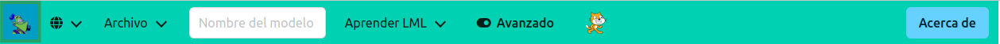

### Cambiar idioma

Puedes cambiar el idioma de la aplicación haciendo clic en el botón con el icono del globo terrestre.

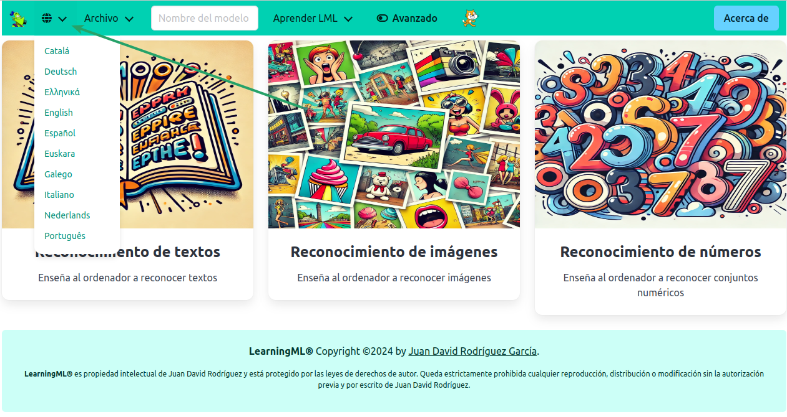

### Menú archivo

Desde este menú puedes realizar las siguientes operaciones:

- **Nuevo**. Volver a la pantalla principal para construir un nuevo modelo. Es equivalente a hacer clic en el icono con la cabeza del genio.

- **Subir conjunto de datos desde tu ordenador**. Se abre un navegador de ficheros con el que puedes buscar un fichero con datos de entrenamiento que previamente has debido guardar en el disco de tu computadora. La extensión de este archivo es `.json`.

- **Guardar conjunto de datos en tu ordenador**. Cuando hayas construido un conjunto de datos de entrenamiento deberías guardarlo en el disco de tu computadora usando este menú. En cualquier momento puedes restaurarlo mediante el menú anterior **Subir conjunto de datos desde tu ordenador**. El nombre del archivo guardado es el que se haya definido en el cuadro de textos a la derecha del menú "Archivo" y la extensión es `.json`. En el caso de que no se haya escrito nada en el cuadro de textos el nombre será "Untitled.sjon".

- **Guardar modelo en tu ordenador**. Esta funcionalidad es una novedad de LearningML+. Al hacer clic en este menú se guardará en la carpeta de *Descargas* un fichero con el nonbre definido en el cuadro de texto (o "lml_Untitled" si no se ha definido) y la extensión `.mdl` que contiene el modelo que se ha creado en la fase de aprendizaje. Por tanto, esta operación solo puede realizarse después de completar dicha fase. Este archivo de modelo puede ser cargado en cualquier momento desde el editor de programación (Scratch) y utilizado para realizar tareas de reconocimiento del tipo de datos para el que ha sido entrenado el modelo. Lo importante es que esto se puede hacer en cualquier momento **sin necesidad de usar el editor de modelos**. En la sección dedicada al **Editor de programación** de este mismo manual volveremos sobre este punto.

### Cuadro de texto para el nombre de los archivos

Aquí puedes escribir el nombre con el que quieres guardar los datos de entrenamiento y el modelo generado.

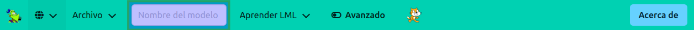

### Menú "Aprender LML"

Desde aquí tienes acceso a este manual y a varios recursos para aprender a usar LearningML+.

### Botón de activación/desactivación del modo avanzado

El modo avanzado de LearningML+ se activa o desactiva haciendo clic en este botón de tipo interruptor.

Por defecto el modo avanzado está desactivado. El fondo del icono del interruptor se muestra vacío.

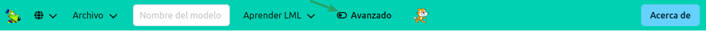.

Al hacer clic en dicho botón se conmuta al modo avanzado. El fondo del icono del interruptor se muestra relleno.

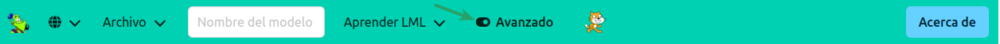

Además, cuando se activa el modo avanzado, el diseño de la pantalla de construcción de modelos cambia. En lugar de aparecer las tres fases del proceso de Machine Learning supervisado en la misma pantalla, cada fase se asocia a una pestaña, y solo una de ellas se muestra.

### Botón "editor de programación"

Al hacer clic en el botón con la imagen del gatito de Scratch se abre, en otra pestaña del navegador, el editor de programación Scratch con los bloques para usar los modelos de Machine Learning.

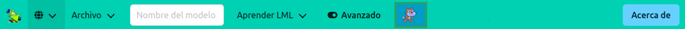

## El modo avanzado de LearningML+